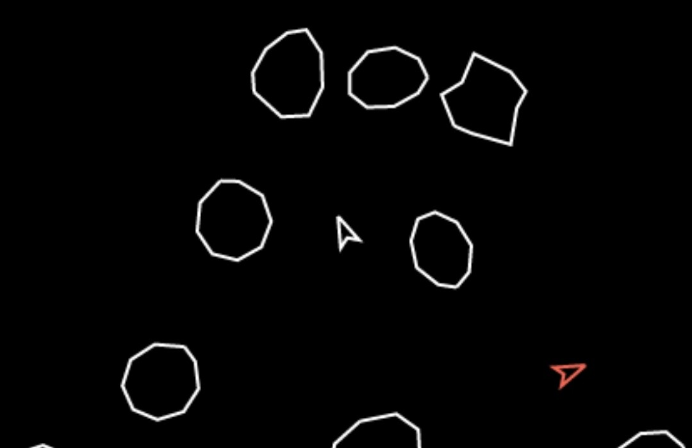

# Asteroids: The Full Game

[Play now!](https://jaller94.gitlab.io/line-factory/)

**Asteroids: The Full Game** is a space-themed exploration game developed for the [js13kGames](https://js13kgames.com/) 2021 game jam. To inspect the submitted code, look for the Git tag `v1.0.0`. Since then, development has continued.

* [Asteroids Extended on js13kGames](https://js13kgames.com/entries/asteroids-extended)
* [Blog article about the development](https://chrpaul.de/2021/09/js13kGames-asteroids-extended.html)

## How to play

Play it using any modern web browser on Desktop and Mobile. You can control the spaceship with your keyboard or overlay buttons on a touch screen.

Asteroids: The Full Game is a small exploration game. It can be controlled with arrow keys and Space to fire. On mobile, click the screen to show overlay buttons. Use "f" for forwards and "w" for weapon to control the ship.

The player does not need to fear dying as none of the objects have collision.

The map has an asteroid field and four planets. The player can shoot the asteroids and fling through space using the gravity of the planets.

## Thanks To
* [Pascal](https://leidenfro.st/) for motivating me to write a game and coming up with the visual style.
* My coworkers for playtesting, giving feedback and being excited about my game.
* Andrzej for organizing the js13kGames each year and being super responsive.

## License
Released under the MIT license.  
See LICENSE file for more information.

Developed by Christian Paul.  
Feel free to contact me at:  
https://gitlab.com/jaller94  
https://chrpaul.de
